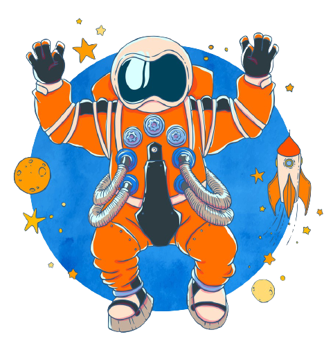

# AstroComerce

  
  

Link do site do projeto no surge: https://crooked-beast.surge.sh/

### PROJETO E-comerce usando Reactjs

O projeto escolhido feito pelo grupo foi um e-comerce baseado em naves espaciais super-faturadas com temática de star wars e da Nasa.

### CONTEÚDO

Foram criadas 2 páginas. As páginas são:
1. **Home**  
 

A página principal do nosso site possui:
  - Texto de de exemplo
  - Imagem ilustrativa
  - Icone
  - Header

2. **Produtos**  
 
 
 
 
 

### FERRAMENTAS
O site foi todo Reactjs e utilizando styled components apenas.
